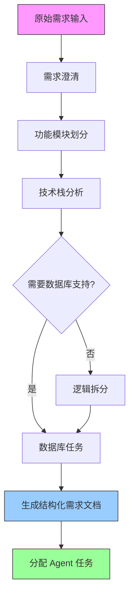

# 需求拆解流程指南

## 概述

本指南提供了一套从自然语言需求到结构化开发任务的系统化拆解方法。通过清晰的需求拆解，确保每个 Agent 都能准确理解自己的任务，减少返工和沟通成本。

## 需求拆解流程



## 详细步骤

### 步骤 1：需求澄清

**目标**：确保需求没有歧义，明确项目范围。

**输入**：用户原始需求。

**输出**：清晰的、结构化的需求描述。

**检查清单**：
- [ ] 核心用户角色是谁？
- [ ] 核心功能是什么？
- [ ] 附加功能有哪些？
- [ ] 哪些功能可以延迟交付？
- [ ] 技术栈是否有明确要求？

### 步骤 2：功能模块划分

**目标**：将整体功能拆分为独立、可并行开发的模块。

**输入**：结构化需求描述。

**输出**：功能模块列表。

**划分原则**：
1. **高内聚**：每个模块内部功能紧密相关
2. **低耦合**：模块之间通过明确定义的接口通信
3. **可独立验证**：每个模块可以独立测试和验证
4. **均衡分配**：各模块工作量大致均衡

**示例划分方式**：
- 按业务领域：如用户管理、内容管理、数据分析
- 按技术层次：如前端界面层、后端服务层、数据持久层
- 按使用流程：如注册登录、数据浏览、数据管理

### 步骤 3：技术栈分析

**目标**：确定实现需求所需的技术组件和工具。

**输入**：功能模块列表 + 需求中的技术限制。

**输出**：技术决策表。

**决策内容**：

| 技术领域 | 选项 | 决策标准 |
|---------|------|---------|
| 前端框架 | React / Vue / Angular | 团队经验、生态成熟度 |
| 后端框架 | Spring Boot / Node.js / Go | 性能要求、开发效率 |
| 数据库 | MySQL / PostgreSQL / MongoDB | 数据结构复杂度、扩展性 |
| 部署方式 | Docker / K8s / Serverless | 运维能力、成本控制 |

### 步骤 4：任务生成

**目标**：为每个 Agent 创建具体的开发任务。

**输入**：功能模块列表 + 技术决策。

**输出**：任务分配表。

**任务模板**：

```json
{
  "task_id": "T001",
  "name": "任务名称",
  "module": "所属模块",
  "agent": "负责 Agent",
  "priority": "high|medium|low",
  "dependencies": ["T000"],
  "input": ["输入信息"],
  "output": ["输出文件列表"],
  "acceptance_criteria": ["验收标准"]
}
```

### 步骤 5：依赖分析

**目标**：识别任务间的依赖关系，确定开发顺序。

**输入**：任务分配表。

**输出**：依赖关系图。

**依赖类型**：
1. **技术依赖**：任务 B 需要任务 A 的输出
2. **时序依赖**：任务 B 必须在任务 A 之后进行
3. **资源依赖**：任务 A 和 B 共享同一资源

## 输出模板

### 结构化需求文档

```markdown
# 项目名称：[项目名称]

## 1. 项目概述
- 项目背景：
- 项目目标：
- 目标用户：

## 2. 功能需求
### 2.1 核心功能
- [功能1]：[详细描述]
  - 用户故事：
  - 验收标准：
- [功能2]：[详细描述]

### 2.2 附加功能
- [功能3]：[详细描述]

## 3. 技术栈
- 前端：[框架 + UI 库 + 构建工具]
- 后端：[框架 + ORM + 数据库]
- 部署：[容器化 + CI/CD + 云平台]

## 4. 接口定义
- [接口1]：[方法 + 路径 + 描述]
- [接口2]：[方法 + 路径 + 描述]

## 5. 数据模型
- [表/模型1]：[字段描述]

## 6. 约束条件
- 性能要求：
- 安全要求：
- 兼容性要求：

## 7. 排除范围
- 明确不包含的功能：
```

### 任务分配表

```json
{
  "project": "项目名称",
  "version": "1.0.0",
  "created_at": "创建时间",
  "tasks": [
    {
      "task_id": "T001",
      "name": "任务名称",
      "module": "所属模块",
      "agent": "frontend|backend|database|integration|security|deployment_test",
      "priority": "high|medium|low",
      "status": "pending|in_progress|completed",
      "dependencies": [],
      "description": "任务详细描述",
      "acceptance_criteria": ["验收标准1", "验收标准2"]
    }
  ]
}
```

## 常见问题

### 需求模糊怎么办？
- 拆解时基于最常见的业务场景做合理假设
- 在假设处添加标记，开发过程中基于实际情况调整
- 优先实现核心流程，非核心流程延迟处理

### 功能太多怎么处理？
1. 按优先级排序：高 > 中 > 低
2. 核心功能必须全量实现
3. 非核心功能使用最小可行方案

### 如何衡量拆解质量？
1. 每个任务是否都能被独立理解和执行？
2. 任务边界是否清晰，没有重叠？
3. 依赖关系是否明确？
4. 验收标准是否可衡量？
